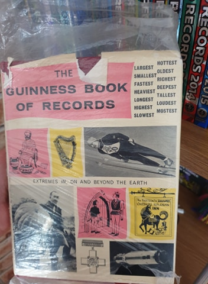
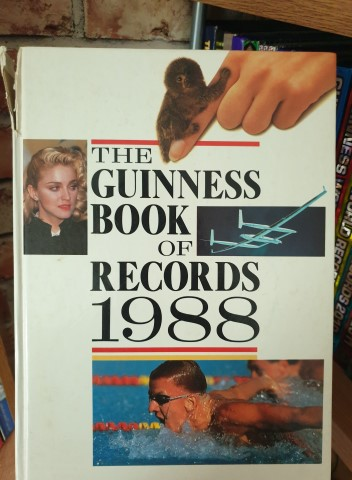

# Collection tracker

## Commands

##### Start the project
```javascript 
npm start
```

##### Run test suite with cypress
```javascript 
npm run cypress
```

## Live site

 [https://collectiontracker-57b9e.web.app/](https://collectiontracker-57b9e.web.app/)

## About this project

This project was built to track my collection of Guiness Book Records. Currently it has 46/65 books and has been going for over 10 years.


## Some sample books

#### 1968 - Poor condition



#### 1988 - Fair condition



#### 2007 - Mint condition


#### 2020 - Mint condition


## Backend

 [https://github.com/BootstrapBilly/Collection_tracker_2020_api](https://github.com/BootstrapBilly/Collection_tracker_2020_api)


## Databases


User submitted images are stored directly in firebase, then the generated url is stored in MongoDb

Everything else is processed by the API and stored in MongoDb


## Notable Algorithms


##### Populate chart data

Used by the dashboard component to feed data to the charts, it can be found at ``` Src/Pages/Dashboard/Functions/populate_chart_data.js ```


##### Sort books into blocks for the bar chart

Used by the bar chart component to classify books into columns to be displayed in the chart, it can be found at ``` Src/Pages/Dashboard/Components/Bar_chart/Functions/Sort_into_blocks.js ```


##### Sort books into order of condition to be displayed

Used by the form component for books which have multiple conditions / duplicates present in the collection. It ensures that books are sorted in order of condition poor/fair/mint, so they are displayed consistently. It can be found at 
``` Src/Pages/Form/Functions/order_books_by_condition ```


##### Handle next click (form)

Used by the form component to validate user input, progress through the form and finally send the request to the API. It can be found at ``` Src/Pages/Form/Functions/handle_next_click.js ```


